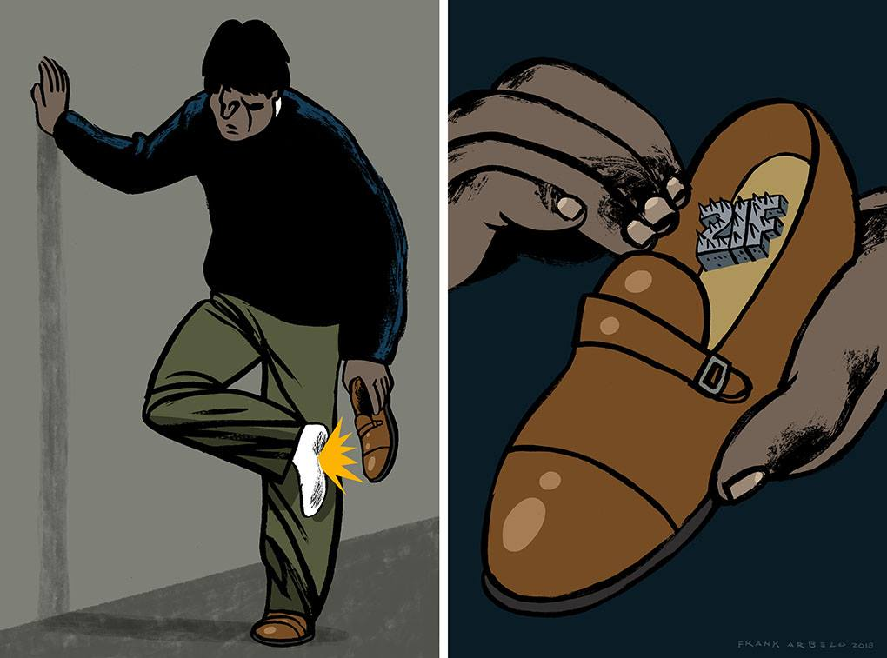

```{r setup, include=FALSE, eval=FALSE}
# 21 F año 2018
Sys.setlocale(locale = "es_ES.UTF-8")

```

0
=====================================  
<center>

<small>Ilustración de [Frank Arbelo](https://www.facebook.com/frankarbelostudio/photos/a.1895369970707412.1073741830.1894171534160589/2060684617509279/?type=3&theater)</small></center>

1
=====================================  
### Voto en el exterior: muchos, estando inscritos, no fueron a votar

<iframe frameBorder="0" src="exterior1.html" width="100%" height="100%" allowtransparency="true"></iframe>
 
2
=====================================  
### Voto en el exterior: Argentina representa la mitad del ausentismo

<iframe frameBorder="0" src="exterior2.html" width="100%" height="100%" allowtransparency="true"></iframe>

3
=====================================  
### Voto en el exterior: Los que si votaron, le redujeron 21% de apoyo a Evo Morales
<iframe frameBorder="0" src="exterior3.html" width="100%" height="100%" allowtransparency="true"></iframe>

4
=====================================  
### Voto en el exterior: De 33 países de incrementa el apoyo en uno solo, con 3 votos

<iframe frameBorder="0" src="exterior4.html" width="100%" height="100%" allowtransparency="true"></iframe>

5
=====================================  
## 1

<iframe frameBorder="0" src="hc.html" width="100%" height="100%" allowtransparency="true"></iframe>

6
=====================================  
## 2
<iframe frameBorder="0" src="hc1.html" width="100%" height="100%" allowtransparency="true"></iframe>

7 
=====================================  
### El presidente necesitaba 69.244 votos más para ganar el 21F. El presidente perdió 99.858 votos en Potosí, El Alto y su propio bastión, el Chapare

<iframe frameBorder="0" src="bastiones.html" width="100%" height="100%" allowtransparency="true"></iframe>

Contactos 
=====================================  
<br>
<br>
<br>
<br>
<br>
<br>
<br>
<br>
<br>
<br>
<br>
<br>

<center>rafa lópez v.<center>

<center>[GitHub](https://github.com/rafalopezv)</center>
<center>[Twitter](https://twitter.com/rafa_lopezv)</center>
<center>[Facebook](https://www.facebook.com/profile.php?id=585845584)</center>
<center>[Linkedin](https://www.linkedin.com/in/rafael-lopez-valverde-a141a325/)</center>


